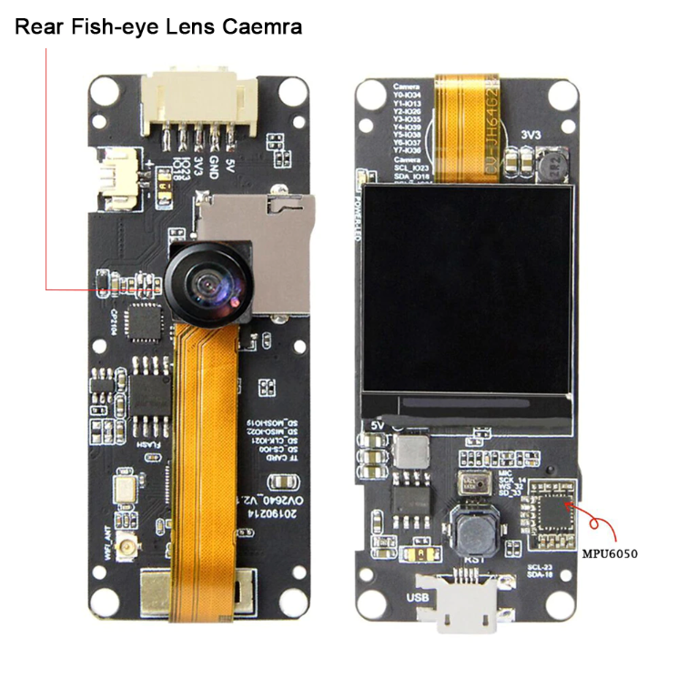
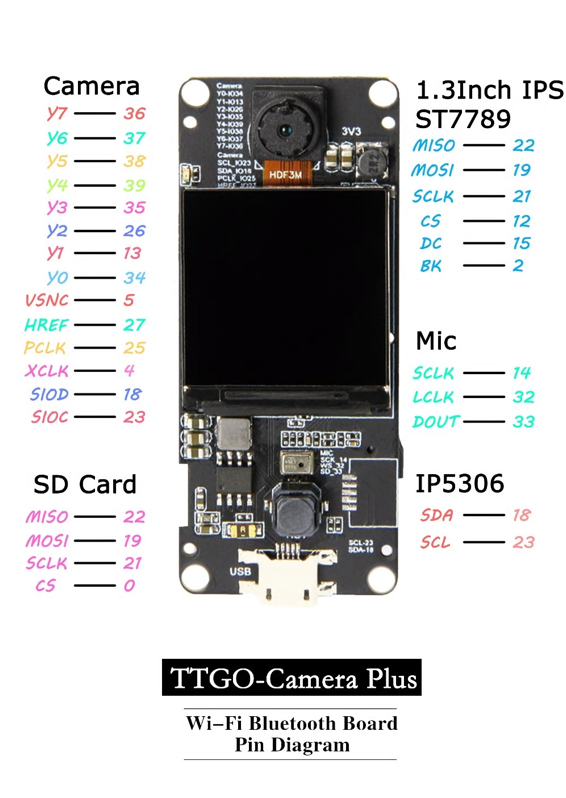

# TTGO-T-Camera-Plus
Basic hardware test with [LILYGO® TTGO T-Camera Plus](http://www.lilygo.cn/prod_view.aspx?TypeId=50067&Id=1272&FId=t3:50067:3).

 This board comes with MPU6050 I2C Module:

Hardware Specifications:

- ESPRESSIF-ESP32-DOWDQ6 240MHz Xtensa® single-/dual-core 32-bit LX6 microprocessor
- FLASH: QSPI flash/SRAM, up to 4 x 16 MB
- 520 kB SRAM + 8MBytes External SPRAM
- display: IPS Panel ST7789/1.3 Inch
- USB to TTL: CP2104
- Camera: OV2640 2Megapixel
- Mic: MSM261S4030H0
- Power management Chip: IP5306